# Setup Guide

This guide will walk you through the different steps to run the project on your local machine. If you will find any screenshot to be blurry, just tap on the screenshot. It will open up in a new tab with full sized image.

We can run the android and iOS builds either from the command-line or from the Android Studio and Xcode.

---
**NOTE**

This is a generalized setup guide. Please consider the `InnovatorRN` occurence to be your project name.

---

## Running from the command-line

  Use the following scripts(added into the `package.json` file) to run the android and iOS apps

  * `yarn iosStagingDebug` for staging debug on iOS
  * `yarn iosProductionDebug` for production debug on iOS
  * `yarn androidStagingDebug` for staging debug on android
  * `yarn androidProductionDebug` for production debug on android

## To run the android build from the Android Studio

  * Open the `Android Studio`
  * Select the `Open an existing Android Studio Project`

      

        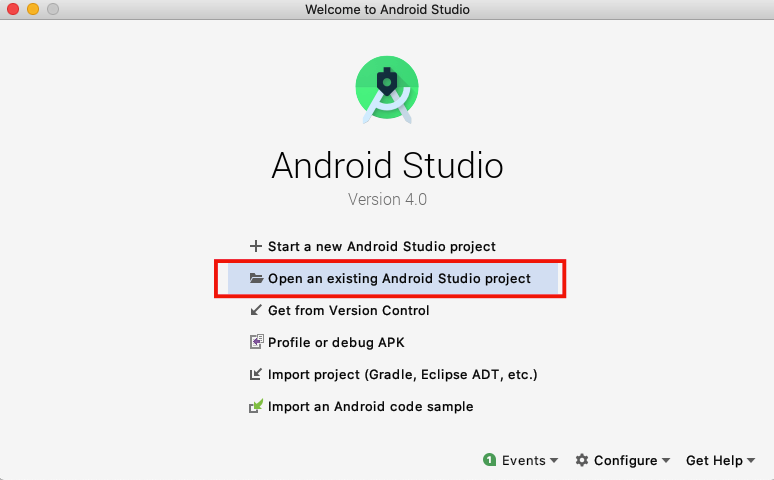
      

  * Choose the `android` folder as shown in the screenshot below:

      

        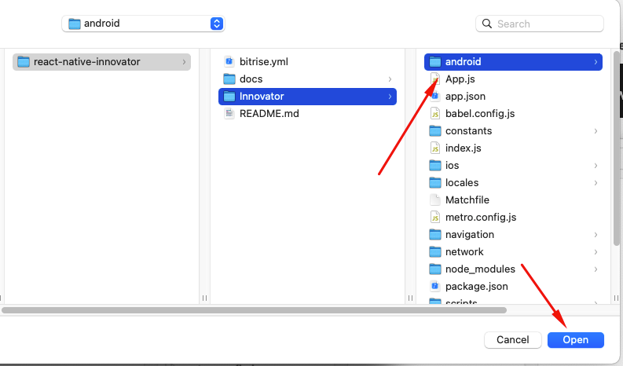
      

  * Wait for the `gradle` to sync and all of the sync process to be finished

      

        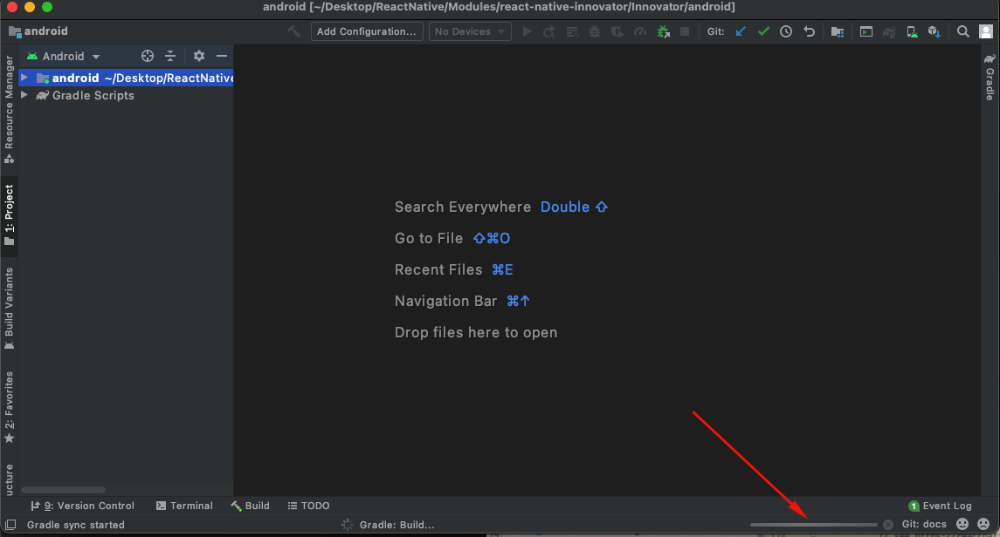
      

  * From the left pannel, look for the `Build Varients` and select the `Build Varients` option

      

        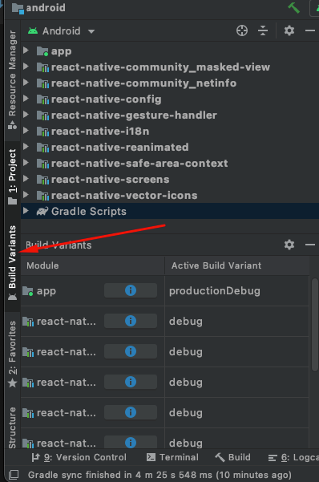
      

  * Select the desired build varient(`stagingDebug` or `productionDebug` for debug builds and `stagingRelease` or `productionRelease` for release builds) from the `app` module's `Active Build Varient` as shown in the screenshot below:

      

        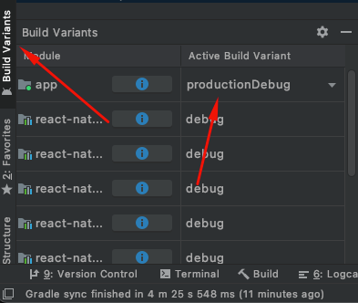
      

      

        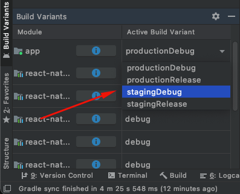
      

  * After selecting the build variant, the `gradle` will sync again. After finishing up the sync of the gradle, you can run your build directly from the `run` option from the top tab-bar in the Android Studio:

      

        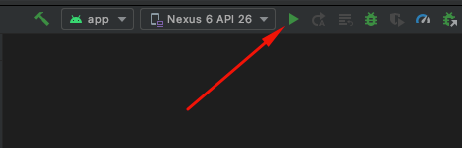
      

  * The selected emulator will start and the build will run in the emulator

## To run the iOS build using the Xcode

  * Go to the `react-native-innovator/Innovator/ios/` directory.
  * Open the file `InnovatorRN.xcworkspace`. Remember, **DO NOT** open the `InnovatorRN.xcodeproj` by mistake.
  
      

        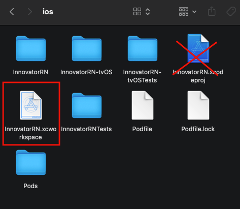
      

  * Tap on the default pre-selected scheme as shown in the screenshot below

      

        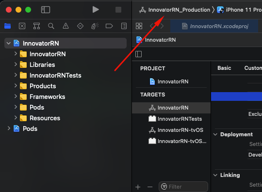
      

  * Select the desired scheme (`InnovatorRN_Staging` for the Staging and `InnovatorRN_Production` for Production)

      

        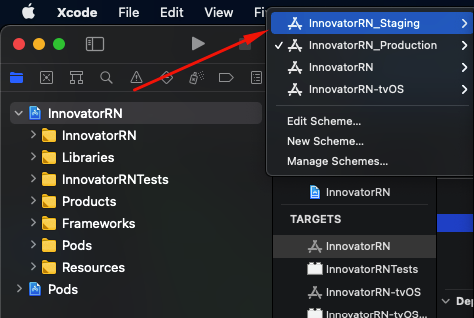
      

  * Hit the `Run` button

      

        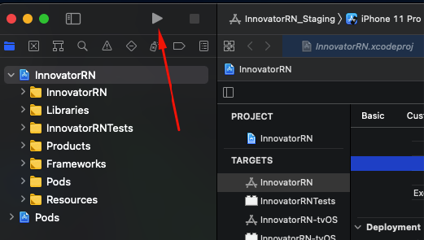
      

  * The selected simulator will start and the build will run in the simulator.
